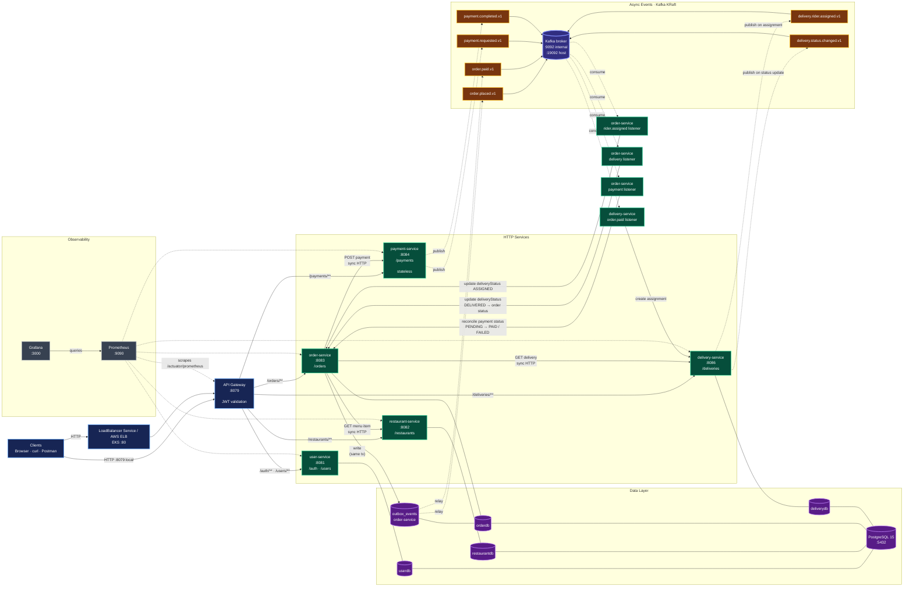

# Architecture Overview



Solid arrows are synchronous HTTP or persistence relationships. Dashed arrows are asynchronous Kafka publication, consumption, or metrics scraping.

## Important Flows

### Place and pay for an order

1. The client sends the request through the API gateway.
2. `order-service` persists the order and synchronously validates menu items with `restaurant-service`.
3. `order-service` synchronously calls `payment-service`. On success it sets order status to `PAID` and writes `order.placed.v1` and `order.paid.v1` to its `outbox_events` table in the same transaction — guaranteeing the DB update and the event intent are atomic.
4. `OutboxRelay` (a 1-second scheduler inside order-service) polls `outbox_events` for unsent rows, publishes each to Kafka via a `StringSerializer`-backed template, and marks the row sent on ack. `delivery-service` consumes `order.paid.v1` and creates the assignment; it then publishes `delivery.rider.assigned.v1`, which `order-service` consumes to set `deliveryStatus = ASSIGNED`. `payment-service` publishes `payment.requested.v1` and `payment.completed.v1` directly (stateless, no DB). `order-service` consumes `payment.completed.v1` as a reconciliation path.

### Delivery status updates

`delivery-service` persists each status transition and publishes `delivery.status.changed.v1`. `order-service` consumes that topic and updates its denormalized `deliveryStatus`; when the event is `DELIVERED`, the order status also becomes `DELIVERED`. Fetching an order also performs a synchronous delivery lookup, providing a reconciliation path in addition to the Kafka listener.

## Service and Data Store Map

| Service | HTTP port | Database | Kafka responsibility |
|---|---:|---|---|
| `api-gateway` | 8079 | — | — |
| `user-service` | 8081 | `userdb` | — |
| `restaurant-service` | 8082 | `restaurantdb` | — |
| `order-service` | 8083 | `orderdb` + `outbox_events` | Publishes `order.placed.v1` and `order.paid.v1` via outbox relay; consumes `payment.completed.v1`, `delivery.rider.assigned.v1`, and `delivery.status.changed.v1` |
| `payment-service` | 8084 | Stateless (no DB) | Publishes `payment.requested.v1` and `payment.completed.v1` |
| `delivery-service` | 8086 | `deliverydb` | Publishes `delivery.rider.assigned.v1` and `delivery.status.changed.v1`; consumes `order.paid.v1` |

The four service databases are separate PostgreSQL databases hosted by one PostgreSQL 15 instance. Services access one another by Compose/Kubernetes DNS names; clients use only the gateway.

## Kafka Topics

| Topic | Publisher | Consumer |
|---|---|---|
| `order.placed.v1` | `order-service` | No application consumer |
| `order.paid.v1` | `order-service` | `delivery-service` (trigger assignment) |
| `payment.requested.v1` | `payment-service` | No application consumer |
| `payment.completed.v1` | `payment-service` | `order-service` (reconciliation) |
| `delivery.rider.assigned.v1` | `delivery-service` | `order-service` (set deliveryStatus ASSIGNED) |
| `delivery.status.changed.v1` | `delivery-service` | `order-service` |

Kafka runs as a single-node KRaft broker without ZooKeeper. Containers and Kubernetes clients use `kafka:9092`; Docker Compose exposes `localhost:19092` for host access.

## Architecture Assessment

This diagram reflects the architecture that is implemented today. It is a sound MVP split: the gateway owns ingress and JWT enforcement, each stateful service owns a separate database, order orchestration uses explicit synchronous calls, and delivery status is propagated asynchronously.

For production scale, the main follow-up concerns are deliberate trade-offs rather than missing components:

- Kafka is single-node and PostgreSQL is a single instance, so both are availability bottlenecks.
- `order-service` uses a transactional outbox (`outbox_events` table + `OutboxRelay` scheduler) so its event publications are atomic with DB commits. `delivery-service` publishes events best-effort (no outbox yet), so a DB commit and event publication can still diverge there.
- Payment is synchronous; delivery assignment is event-driven (choreography saga). There is no compensation mechanism if delivery assignment fails after payment succeeds.
- Internal service ports are reachable inside the deployment network; network policies and service-level authorization would be needed for stronger isolation.

## Deployment Modes

**Docker Compose**

```bash
cp .env.example .env
mvn -DskipTests clean package
docker compose up --build
```

Gateway: `http://localhost:8079`. Prometheus and Grafana are available at `localhost:9090` and `localhost:3000`.

**Minikube**

```bash
eval $(minikube docker-env)
kubectl apply -f k8s/
kubectl port-forward -n food svc/api-gateway 8079:8079
```

**AWS EKS**

```bash
bash scripts/eks-up.sh
bash scripts/eks-down.sh
```

The `api-gateway` Service is patched to `type: LoadBalancer` by `eks-up.sh`, which provisions an AWS load balancer on port 80. The `30-ingress.yaml` Ingress manifest exists in the repo but is not applied by the EKS deploy script.

## Authentication and Health

The gateway validates HS256 JWTs for protected routes. `/`, `/health`, `/info`, `/actuator/**`, `POST /auth/register`, and `POST /auth/login` remain public; all other gateway routes require a token. `JWT_SECRET` must be shared by `api-gateway` and `user-service` and should be at least 256 bits.

Every service exposes health and Prometheus metrics through its actuator endpoints.
